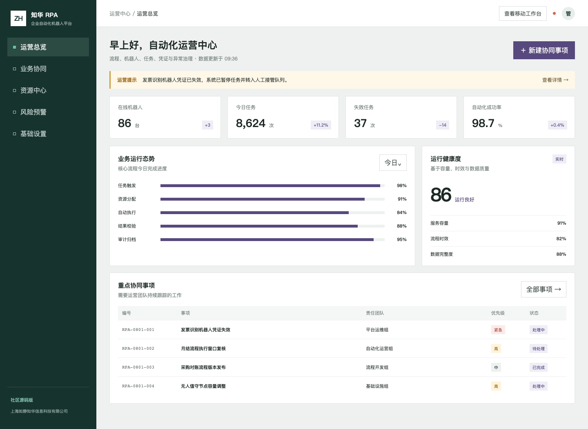
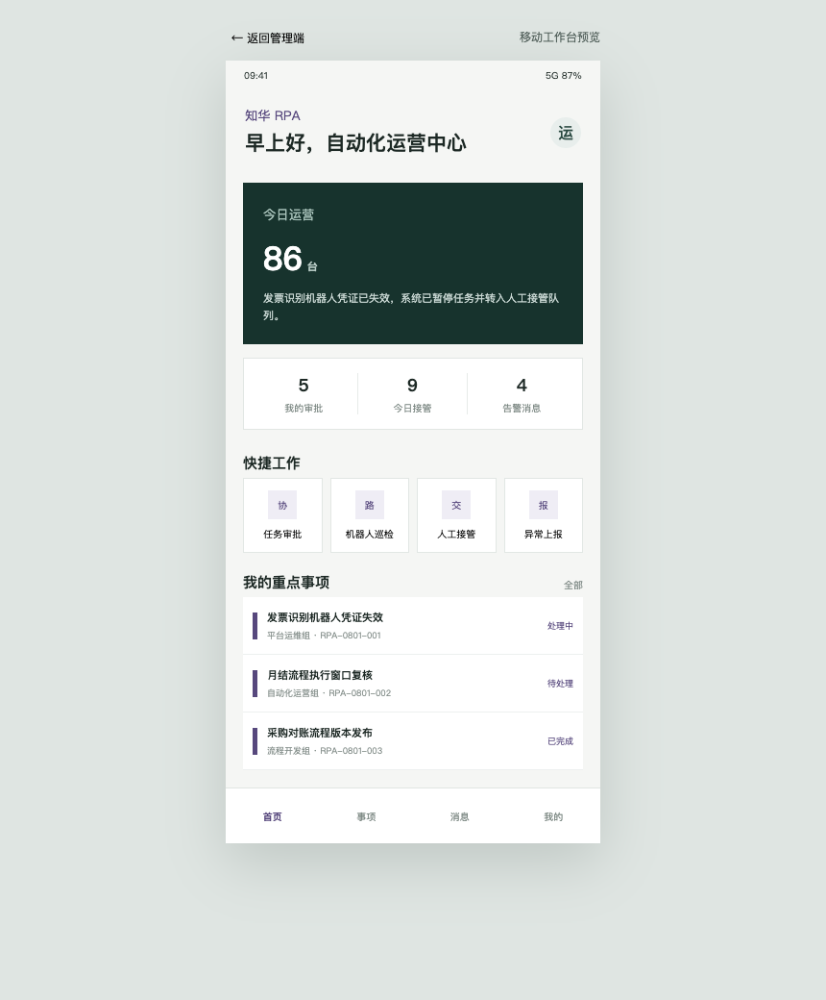

<div align="center">

# ZhuaTech RPA · 知华企业自动化机器人平台

面向流程、机器人、任务、凭证与异常治理的前后端分离社区源码项目

[官网](https://www.zhuatech.cn/) · [功能地图](#功能地图) · [快速启动](#快速启动) · [使用许可](#使用许可) · [定制咨询](#定制咨询)

</div>

> 版权所有 © 2026 上海如静知华信息科技有限公司。项目仅限个人非商业学习、研究与技术交流；商用、企业内部生产使用、SaaS、交付或二次开发服务均须取得书面授权。

## 一眼了解项目

ZhuaTech RPA 是知华科技推出的企业自动化机器人系统社区源码版。首版以“运营态势—协同事项—移动执行—风险评估”为主线，把管理者的全局视角和一线人员的移动工作台放在同一套业务模型中。项目采用 Java 21、Spring Boot、Vue 3 与 MySQL，可作为前后端分离、权限控制、运营看板和移动适配的学习样例。



<p align="center"><em>管理端：流程、机器人、任务和异常事项的统一运营视图</em></p>



<p align="center"><em>用户端：面向运营人员与自动化运营与流程开发团队的移动工作台</em></p>

## 功能地图

| 使用角色 | 已实现能力 | 典型价值 |
| --- | --- | --- |
| 运营管理者 | 核心指标、流程进度、重点事项、健康度评估 | 快速发现资源与时效风险 |
| 自动化协同人员 | 待办列表、优先级、责任团队、快捷工作入口 | 减少跨团队沟通遗漏 |
| 系统管理员 | 管理/操作员权限隔离、接口鉴权、数据初始化 | 提供可继续扩展的安全基线 |
| 移动用户 | 响应式 H5 工作台、事项查看、异常上报入口 | 支持运维移动处置场景 |

后端还提供运营风险评估接口，结合积压、延期、关键事项、容量利用率与数据完整度给出分级结果和行动建议。该结果仅用于软件学习演示，不替代企业正式风控与业务决策。

## 技术结构

```text
zhuatech-rpa/
├── backend/       Spring Boot 4 / Java 21 / Spring Security / JPA
├── frontend/      Vue 3 / Vite / 响应式管理端与 H5
├── docs/          架构、接口与项目截图
├── compose.yaml   MySQL、后端、前端一键编排
└── LICENSE        知华科技个人非商业社区源码许可
```

## 快速启动

环境建议：JDK 21、Maven 3.9+、Node.js 22+、MySQL 8.4+；也可直接使用 Docker Compose。

```bash
cp .env.example .env
docker compose up --build
```

启动后访问 `http://localhost:8090`。本地演示管理账号为 `admin / admin123`，操作员账号为 `operator / operator123`。这些仅是开发默认值，任何联网或生产环境都必须通过环境变量替换，并增加企业级身份认证、审计与数据脱敏。

单独启动开发环境：

```bash
cd backend && mvn spring-boot:run
cd frontend && npm install && npm run dev
```

接口示例：

```bash
curl -u admin:admin123 http://localhost:8080/api/admin/dashboard
curl -u admin:admin123 -H 'Content-Type: application/json' \
  -d '{"backlog":18,"delayedItems":3,"criticalItems":1,"capacityUtilization":91,"dataCompleteness":86}' \
  http://localhost:8080/api/admin/risk-assessment
```

更多信息见 [接口说明](docs/API.md) 与 [架构说明](docs/ARCHITECTURE.md)。

## 使用许可

本项目采用 **ZhuaTech Community Source License 1.0（个人非商业版）**，不是 OSI 认可的开源许可证。

- 可以：个人学习、研究、技术交流、非商业修改。
- 不可以：企业内部生产使用、商业部署、SaaS、收费下载、外包交付、售卖、投标、品牌替换或任何直接/间接获利行为。
- 需要商业使用、生产部署或深度开发定制时，必须先取得上海如静知华信息科技有限公司书面授权。

详情以 [LICENSE](LICENSE) 为准。

## 定制咨询

知华科技（上海如静知华信息科技有限公司）提供企业数字化、软件项目外包、系统集成、私有化部署和深度定制服务。

- 官方网站：[https://www.zhuatech.cn/](https://www.zhuatech.cn/)
- 商业授权与深度定制：可通过官网联系，也可扫描下方任一微信二维码咨询。

<p align="center">
  
  &nbsp;&nbsp;&nbsp;&nbsp;
  
</p>

## 安全与贡献

本仓库不包含真实业务数据、真实生产接口凭据或生产配置。请勿提交个人隐私与业务敏感信息、访问令牌、私钥或真实业务数据。安全问题请按 [SECURITY.md](SECURITY.md) 私下报告；参与开发前请阅读 [CONTRIBUTING.md](CONTRIBUTING.md)。

关键词：知华科技 RPA、RPA 管理系统、机器人运营管理、企业自动化平台、Java RPA 系统、Spring Boot RPA、Vue 企业管理系统、上海软件定制开发。

## 自动化适用性评估

新增 `POST /api/rpa/insights/automation-suitability`，从规则化比例、异常率、系统数量、输入稳定性、敏感数据和人工判断要求评估自动化可行性，并估算年度节省工时。

## 企业级机器人生产发布

新增 `POST /api/enterprise/rpa/bot-production-release`，覆盖凭据、职责、测试、回滚、权限、责任、幂等、监控和异常率，返回 `DEPLOY / PILOT / BLOCKED`。详见 [机器人发布说明](docs/ENTERPRISE_BOT_RELEASE.md)。
